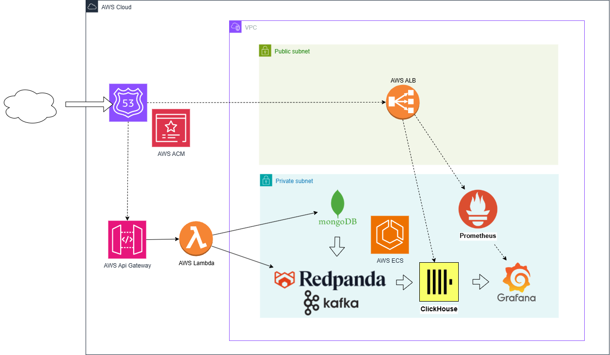

# ClickHouse & MongoDB Components (EC2) — Redpanda-ready + S3 Backups + Observability



Terraform components to deploy **ClickHouse** (and optionally **MongoDB**, **Redpanda**, **Kafka Connect**) on EC2 with:

- Dedicated **EBS** data volumes  
- **IAM role–based backups to Amazon S3** for both ClickHouse and MongoDB  
- **Automatic restore** on first boot from latest S3 backup  
- **Kafka / Redpanda** ingest wiring (Kafka engine table + Materialized View)  
- **systemd–managed bootstrap scripts** and **manual backup helpers**  
- Optional local **observability bundle**: **Prometheus**, **Grafana**, **Node Exporter**, **ClickHouse /metrics**  
- Discovery via **SSM Parameter Store** runtime JSON  
- A **ClickHouse-only mode** that cleanly disables Mongo, Redpanda, and Kafka Connect

---

### Usage  
By default, all components (**MongoDB**, **Redpanda**, **Kafka Connect**) are deployed:  
```bash
./scripts/deploy.sh clickhouse -usekarma-dev
```

### ClickHouse-only mode  
To deploy **ClickHouse only**, set it in your `config.json`:  
```json
{ "clickhouse_only": true }
```

This disables **MongoDB**, **Redpanda**, and **Kafka Connect** during deployment.

---

## Inputs (from `config.json`)

### Required Infra

- `vpc_nickname` – VPC component nickname (used to read `/iac/vpc/<nick>/runtime`)
- `s3_bucket_nickname` – S3 bucket component nickname (used to read `/iac/s3-bucket/<nick>/runtime`)
- `s3_bucket_prefix` – component prefix (used for backups and scripts)
- `clickhouse_bucket` – S3 bucket name for ClickHouse assets and backups (e.g., `usekarma.dev-prod`)
- `clickhouse_prefix` – S3 key prefix (e.g., `clickhouse`); backups stored under `<prefix>/backups/`

### EC2 & Storage

- `instance_type` – default `m6i.large`
- `ebs_size_gb` – default `500`
- `ebs_type` – default `gp3` (`ebs_iops`, `ebs_throughput` supported)

### ClickHouse

- `clickhouse_version` – default `24.8` (repo track)
- `http_port` – default `8123`
- `tcp_port` – default `9000`

### MongoDB (optional, controlled by `enable_mongo` / `clickhouse_only` / `ch_only`)

- `mongo_enable` – default `true` (ignored when `clickhouse_only = true` or `ch_only = true`)
- `mongo_instance_type` – default `r6i.large`
- `mongo_volume_gb` – default `300`
- `mongo_port` – default `27017`
- `mongo_major` – default `"7.0"`
- `mongo_rs_name` – default `"rs0"`
- `mongo_allowed_security_group_ids` – optional list of extra SG IDs that may connect to Mongo
- `mongo_allowed_cidrs` – optional CIDR allowlist (for admin / jump hosts)

Mongo backups share the main `s3_bucket_prefix`, under:

- `<prefix>/backups/dump-YYYYMMDDTHHMMSSZ/`

### Kafka / Redpanda Ingest (optional, controlled by `enable_redpanda` / `clickhouse_only` / `ch_only`)

- `redpanda_enable` – default `true` (ignored when `clickhouse_only = true` or `ch_only = true`)
- `redpanda_instance_type` – default `c6i.large`
- `redpanda_volume_gb` – default `200`
- `redpanda_port` – default `9092`
- `redpanda_admin_port` – default `9644`
- `redpanda_topic` – default `clickhouse_ingest`
- `redpanda_partitions` – default `3`
- `redpanda_retention_ms` – default `604800000` (7 days)

### Kafka Connect / Debezium (optional, controlled by `enable_kconnect` / `clickhouse_only` / `ch_only`)

- `enable_kconnect` – default `true` (ignored when `clickhouse_only = true` or `ch_only = true`)
- `ecs_cluster_nickname` – existing ECS cluster runtime in SSM
- `kconnect_service_name` – default `svc-<nickname>`
- `kconnect_cpu` – default `1024`
- `kconnect_memory` – default `2048`
- `kconnect.image` – default `quay.io/debezium/connect:3.3.1.Final`
- Internal topics / group IDs (optional overrides):
  - `kconnect_group_id`
  - `kconnect_config_topic`
  - `kconnect_offset_topic`
  - `kconnect_status_topic`

### Observability (optional; independent of ClickHouse-only mode)

- `enable_observability` – default `true`
- `prometheus_ver` – default `2.54.1`
- `nodeexp_ver` – default `1.8.1`

Observability can stay **on** even in ClickHouse-only mode (you still get Prometheus + Grafana on the ClickHouse node).

---

## Outputs

- `instance_id`, `private_ip`, `security_group_id`, `data_volume_id`
- `clickhouse_bucket`, `clickhouse_prefix`
- `runtime_parameter_path` – SSM path with runtime JSON  

If `redpanda_enable = true`, also:
- `redpanda_instance_id`, `redpanda_private_ip`, `redpanda_security_group_id`
- `redpanda_brokers` (e.g., `10.0.1.23:9092`) written into runtime JSON

---

## What Gets Created

- **EC2** (Amazon Linux 2023) with **EBS** data volume  
- **IAM:** `AmazonSSMManagedInstanceCore` + scoped S3 policy for both MongoDB and ClickHouse backups  
- **SSM runtime JSON** at `/iac/<component>/<nickname>/runtime`
- (**Optional**) **Redpanda** single node (PLAINTEXT in-VPC for PoC)
- (**Optional**) **Prometheus** (9090), **Grafana** (3000), **Node Exporter** (9100), **ClickHouse /metrics** (9363)

---

## User-data Highlights (First Boot)

### 🧩 ClickHouse
- Installs `clickhouse-server` and `clickhouse-client`
- Mounts EBS volume at `/var/lib/clickhouse` (XFS)
- Configures `/etc/clickhouse-server/config.d/30-s3-backup.xml` with:
  ```xml
  <type>s3_plain</type>
  <endpoint>https://$${CLICKHOUSE_BUCKET}.s3.$${AWS_REGION}.amazonaws.com/$${CLICKHOUSE_PREFIX}/backups/</endpoint>
  <use_environment_credentials>true</use_environment_credentials>
  <region>$${AWS_REGION}</region>
  ```
- On first boot, automatically restores from the **latest `manual-*` backup** under `<prefix>/backups/`
- If no backup is found, starts clean
- Installs `/usr/local/bin/clickhouse-backup.sh` for manual backup creation

### 🍃 MongoDB
- Installs `mongod`, `mongosh`, and configures replica set `rs0`
- Mounts EBS volume at `/var/lib/mongo`
- Checks S3 for the **latest `dump-*` backup** under `<prefix>/backups/`
- If found, downloads and restores via `mongorestore --gzip --drop`
- If not found, initializes schema with `/usr/local/bin/init-sales-db.js`
- Installs `/usr/local/bin/mongo-backup-s3.sh` for manual dumps to S3

---

## Validation After Apply

```bash
aws ssm start-session --target <instance_id>

# ClickHouse
clickhouse-client -q "SELECT version(), now()"
aws s3 ls s3://<clickhouse-bucket>/<clickhouse-prefix>/backups/

# MongoDB
mongosh --eval "db.runCommand({ connectionStatus: 1 })"
aws s3 ls s3://<clickhouse-bucket>/<clickhouse-prefix>/backups/ | grep dump-
```

---

## 🔁 Backup / Restore Strategies

### 🧠 ClickHouse

**Manual backup:**

```bash
TS=$(date -u +%Y%m%dT%H%M%SZ)
clickhouse-client -q "BACKUP DATABASE sales TO Disk('s3_backups', 'manual-${TS}/')"
```

**Restore manually:**

```bash
clickhouse-client -q "RESTORE DATABASE sales FROM Disk('s3_backups', 'manual-<timestamp>/')"
```

**Auto-restore:** On first boot, the instance restores automatically from the latest `manual-*` backup under `<prefix>/backups/`.

---

### 🍃 MongoDB

**Manual backup to S3:**

```bash
/usr/local/bin/mongo-backup-s3.sh
```

Creates compressed dumps under:
```
s3://<clickhouse-bucket>/<clickhouse-prefix>/backups/dump-YYYYMMDDTHHMMSSZ/
```

**Restore manually (local or S3):**

```bash
aws s3 sync s3://<clickhouse-bucket>/<clickhouse-prefix>/backups/dump-<timestamp>/ /tmp/mongo-restore/
mongorestore --gzip --drop --uri="mongodb://127.0.0.1:27017" /tmp/mongo-restore/
```

**Auto-restore:** On first boot, the instance restores automatically from the latest `dump-*` folder found in `<prefix>/backups/`.

---

## 📊 Observability

If `enable_observability = true`:
- Prometheus and Grafana are installed locally on the EC2 instance.  
- Dashboards include ClickHouse metrics, Mongo metrics (via exporters), and node-level telemetry.  
- Exposed ports:  
  - Prometheus `:9090`  
  - Grafana `:3000`  
  - Node Exporter `:9100`  
  - ClickHouse `/metrics` `:9363`  

---

_Last updated: 2025-11-10 America/Chicago_
