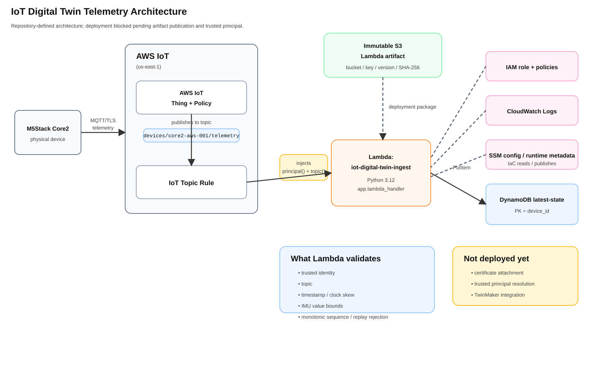

# IoT digital-twin sandbox

This component consumes the existing aws-config contract exposed as:

- `/iac/<component>/<nickname>/config`
- `/iac/<component>/<nickname>/runtime`

It is intentionally minimal and review-only: it reads the config from SSM, builds the IoT/Lambda/DynamoDB skeleton for the digital-twin prototype, and exposes the runtime metadata without generating any device certificates or live AWS mutations during local validation.

## Compatibility

The repository currently supports aws-config contract version 1 only as defined in `contracts/aws-config-compatibility.json`. No version bump was required for this component because the config already matches the established `/iac/<component>/<nickname>/config` model and the keys used by the sandbox follow the existing SSM-driven pattern.

## Trust model

This component preserves the security semantics from the design review:

- device certificates are authoritative, but certificate creation remains a separate human-controlled step,
- `device_id` remains data-only rather than a server-side trust anchor,
- `reject_device_authored_offline` and `connectivity_state_server_derived` are enforced server-side,
- lambda-side replay and staleness checks are expected to be implemented at the ingestion boundary before state writes.

## Scope

The module intentionally does not create an AWS IoT certificate or principal attachment. Those operations require secret material and should be executed only in a reviewed, authenticated AWS sandbox workflow. This keeps the Terraform module deterministic and safe for local repo validation while still producing a meaningful IoT/Lambda/DynamoDB plan.

## Teardown

This repository never performs apply or destroy operations during validation. A real sandbox can be torn down later by the authorized operator after the config and runtime metadata have been reviewed and approved.

## Runtime artifact integration

The ingestion Lambda now uses aws-iac's shared Lambda module and requires an
explicit `ingest_function` declaration. Runtime source remains in aws-lambda;
no placeholder ZIP or local-path fallback exists. The runtime requires
`python3.12`, `app.lambda_handler`, `iot-digital-twin-ingest.zip`, an exact
expected principal, derived device identity/table and a matching telemetry topic.
See [the declaration/handoff contract](../../docs/lambda-artifact-contract.md).
Merged aws-config contract v1 is structurally compatible; its unresolved
artifact and trusted principal still block planning. Certificate attachment and TwinMaker remain excluded/deferred.

## Architecture diagram

This diagram shows the repository-defined telemetry path and supporting infrastructure.
Deployment remains blocked pending artifact publication and trusted-principal resolution;
certificate attachment and TwinMaker integration remain deferred.

[View SVG](../../docs/diagrams/iot-digital-twin-telemetry-architecture.svg) ·
[Editable diagrams.net source](../../docs/diagrams/iot-digital-twin-telemetry-architecture.drawio)
