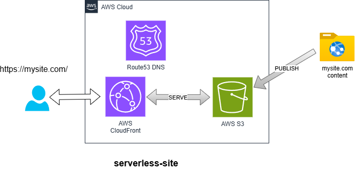

# Serverless Site Component



This Terraform component deploys a static, HTTPS-enabled website hosted on S3 and served via Amazon CloudFront. It supports both default and custom domains, and integrates cleanly with config-first, multi-account setups using ACM, Route 53, and Parameter Store.

---

## Features

- Private S3 bucket for static content
- CloudFront distribution with custom error handling
- Optional custom domain support via ACM (in `us-east-1`)
- Route 53 A-record alias creation
- Viewer-request CloudFront function to rewrite `/path/` to `/path/index.html`
- Stores runtime values in SSM Parameter Store

---

## Usage

Deploy with:

```bash
AWS_PROFILE=prod-iac ./scripts/deploy.sh serverless-site strall-com --auto-approve
```

This will:

1. Read config from: `/iac/serverless-site/strall-com/config`
2. Deploy S3 + CloudFront + optional ACM/Route 53
3. Store runtime output in: `/iac/serverless-site/strall-com/runtime`

---

## Required Inputs (`/iac/serverless-site/<nickname>/config`)

```json
{
  "enable_custom_domain": true,
  "site_name": "strall.com",
  "domain_aliases": ["www.strall.com"],
  "route53_zone_name": "strall.com",
  "content_bucket_prefix": "strall-site-prod",
  "cloudfront_comment": "strall.com static site",
  "tags": {
    "Project": "strall",
    "Environment": "prod"
  }
}
```

Set `enable_custom_domain` to `false` to skip custom domain setup.

---

## Outputs (`/iac/serverless-site/<nickname>/runtime`)

```json
{
  "content_bucket_prefix": "strall-site-prod",
  "cloudfront_distribution_id": "E123456789ABC",
  "cloudfront_distribution_domain": "d1234.cloudfront.net"
}
```

These values can be consumed by deployment scripts or monitoring dashboards.

---

## How It Works

- The component **does not** require any code changes to enable custom domains — only config.
- If a custom domain is enabled:
  - An ACM certificate is requested and validated via Route 53
  - The certificate is created via the reusable [`acm-certificate`](https://github.com/tstrall/aws-modules/tree/main/acm-certificate) module
  - A Route 53 A-record alias is created for each domain

---

## Dependencies

To support custom domains, the following must already exist:

- A [Route 53 hosted zone](../route53-zone) for your domain
- Delegation from your registrar (e.g., GoDaddy) to AWS nameservers

See [route53-zone README](../route53-zone/README.md) for setup instructions.

---

## Example Viewer Rewrite Function

This CloudFront function rewrites `/path/` to `/path/index.html`:

```js
function handler(event) {
  var request = event.request;
  var uri = request.uri;
  if (uri.endsWith('/')) {
    request.uri += 'index.html';
  }
  return request;
}
```

---

## Notes

- ACM validation requires public DNS resolution via Route 53.
- The ACM certificate is created in `us-east-1` due to CloudFront requirements.
- This component assumes Terragrunt is used to inject remote state configuration.

---

## License

This component is open source and licensed under the [Apache 2.0 License](https://www.apache.org/licenses/LICENSE-2.0).
