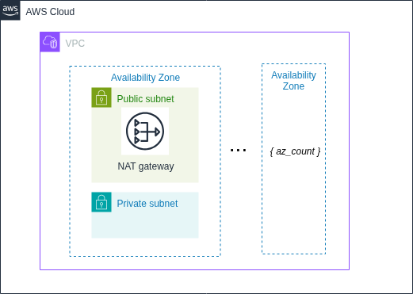

# VPC Component



This component provisions a general-purpose VPC for use by other Adage components.  
It is intended to be reusable across projects and environments, with configuration defined entirely in `aws-config` JSON files and no hardcoded variables.

## Features

- Creates a new VPC with:
  - Configurable CIDR (default: `10.42.0.0/16`)
  - Public and private subnets across `az_count` Availability Zones (default: 2)
  - DNS support and hostnames enabled
- Internet gateway for public subnets
- NAT gateway(s) for private subnets
  - Default: single NAT in the first public subnet (cheaper)
  - Optionally one NAT per AZ for HA
- Optional **SSM interface endpoints** (`ssm`, `ssmmessages`, `ec2messages`)  
  - Allows Session Manager access from private subnets without NAT
- A **default security group** for general application use:
  - No ingress by default
  - Full egress allowed
  - Optional self-ingress (`default_sg_allow_self`)
  - Optional extra ingress CIDRs (`default_sg_extra_ingress_cidrs`)
- Publishes a single **runtime parameter** to AWS SSM Parameter Store, containing:
  - `vpc_id`
  - `vpc_cidr`
  - `public_subnet_ids`
  - `private_subnet_ids`
  - `default_sg_id`
  - `has_nat`
  - `ssm_endpoints` (list of endpoint IDs, if created)

## Inputs

All inputs are read from `locals.config`, which is populated by Terragrunt from your `aws-config` repo.  
Example `aws-config/iac/prod/vpc/use-karma-dev/config.json`:

```json
{
  "cidr": "10.42.0.0/16",
  "az_count": 2,
  "enable_ssm_endpoints": true,
  "single_nat_gateway": true,
  "default_sg_name": "usekarma-dev-sg-default",
  "default_sg_allow_self": false,
  "default_sg_extra_ingress_cidrs": ["203.0.113.42/32"],
  "tags": {
    "Environment": "prod",
    "Project": "usekarma",
    "Owner": "team"
  }
}
